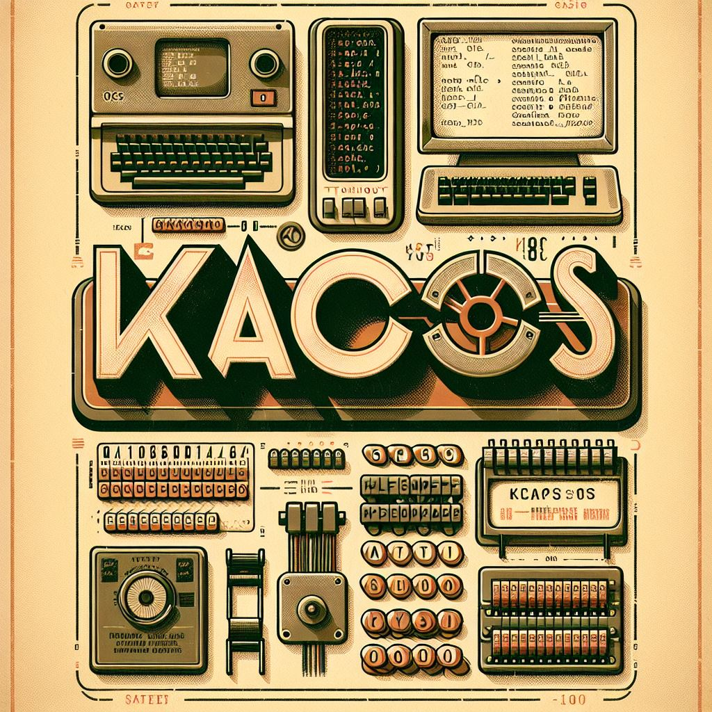

# Ka0S

  

Albert Einstein dijo una vez: "... si tu intención es describir la verdad, hazlo con sencillez y la elegancia dejasela al sastre."

## Table of Contents

1. Nuestra filosofía
2. ¿Qué es Ka0S?
3. ¿Y cómo me lo puedo instalar?
4. El equipo
5. ¿Y si quiero contribuir con el proyecto?
6. License
7. Contact

## Nuestra filosofía

El método **KAIZEN** engloba el concepto de la mejora contínua basada en pequeñas acciones concretas, simples y poco onerosas, donde se ven implicados todos los miembros de una empresa.

## ¿Qué es Ka0S?

Si tuviesemos que explicarlo con una única frase, Ka0S sería algo así como ".... la organización fundamental de un sistema, compuesta por sus módulos, las relaciones entre ellos y su entorno, así como los principios que gobiernan su diseño y evolución."

Si entramos mas en detalle, podemos decir que Ka0S es; *... es un framework, basado en código, que permite en todo momento que todos los miembros de una empresa puedan gestionar el ecosistema de herramientas, al que esta asociado Ka0S, permitiendo que en base a una reglas comunes para todos, cada uno pueda mantener y evolucionar los componentes de los cuales es responsable de una manera sencilla, simple y segura.*

Ventajas de utilizar Ka0S

- Revisión de código continuo *Permite detectar y corregir errores de manera temprana, mejorando la calidad del código.*
- Automatización de pruebas *Asegura que todas las funcionalidades se prueben de manera consistente y eficiente.*
- Refactorización Continua *Facilita la mejora constante del código sin afectar su funcionalidad.*
- Integración Contínua y Entrega Contínua *Permite integrar y entregar cambios de manera rápida y segura.*
- Reatroalimentación y reciclaje del código *Fomenta la mejora continua a través de la retroalimentación y la reutilización de componentes.*

## ¿Y cómo me lo puedo instalar?

A fecha de hoy es tan secillo como seguir los pasos de:

- Solicitar al equipo Core de Ka0s "un fork" actualizado del respositorio. *Actualmente estamos trabajando es que la solicitud se haga de manera automática, mediante una template.*
- Documentación personalizada de la configuración de Ka0S en tu entorno

## El equipo

- **Name:** SantaKloud
  - **Role:** Lead Team - Developer - Admin Project
  - **Biography:** [Biography](https://www.linkedin.com/in/alejandrosantacanacanton/)
  - **PersonalSite:** [PersonalSite](https://santakloud.github.io/)
- **Name:** Yolanda B.N.
  - **Role:** Lead Team - Developer - Admin Project
  - **Biography:** Brief description of the team member.

## ¿Y si quiero contribuir con el proyecto?

En estos momentos estamos trabajando en el proceso y el procedimiento para poder abrir la colaboración al proyecto de Ka0S. En breve estará disponible..

## License

Information about the [license](./LICENSE) under which the project is distributed.

## Contact

Contact information for questions or support.

- **Name:** Ka0S Support
- **Email:** santacana.canton@icloud.com (add [KAOS] in the title of email)
- **GitHub:** SantaKloud
